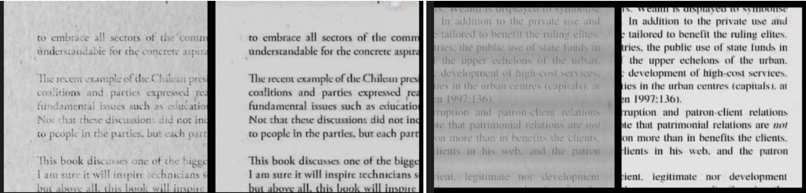

# Document Denoiser

The goal of this project is to train a model in order to take a
noisy document image as input and output a clean version of it.

The model is implemented using a UNet-based architecture and is trained on
a dataset found on [Kaggle](https://www.kaggle.com/code/shengyou222/what-is-augraphy). 
It contains noisy document images and their clean counterparts. It was 
generated using Augraphy, a tool for generating synthetic data.

The loss function used is the Mean Squared Error and the optimizer is Adam. 

Some results from the model are shown below.

